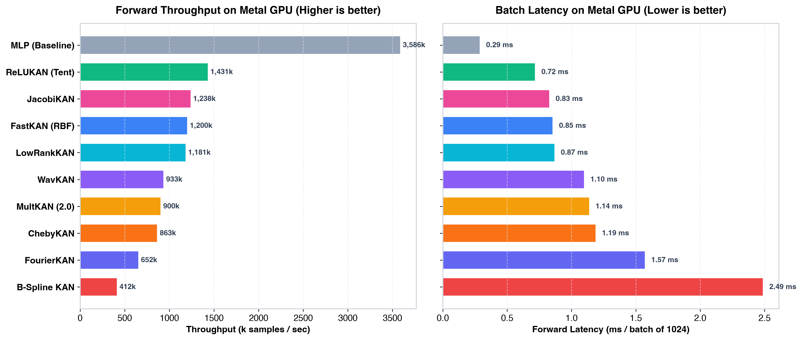
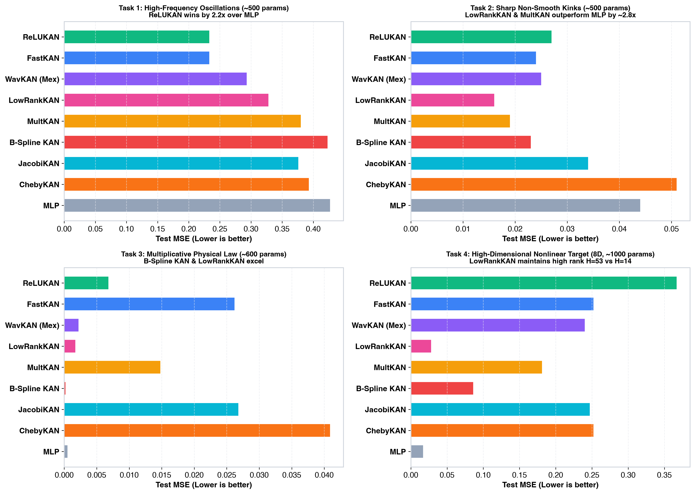

# mlx-KANs

[](https://www.python.org/downloads/)
[](https://github.com/ml-explore/mlx)
[](https://developer.apple.com/metal/)
[](https://opensource.org/licenses/MIT)

**mlx-KANs** is a high-performance suite of **Kolmogorov-Arnold Networks (KAN)** built on top of [Apple MLX](https://github.com/ml-explore/mlx), specifically optimized for **Apple Silicon (M1 / M2 / M3 / M4 / Pro / Max / Ultra)** with custom Metal Shading Language (MSL) kernels, mixed-precision FP16/BF16, zero-allocation GEMM projections, and unified memory acceleration.

> 🇷🇺 *Русскоязычная версия документации доступна в [README_RU.md](README_RU.md).*

---

## Key Highlights

- **9 Modern KAN Architectures in One Package**:
  - `FastKAN` (Gaussian RBF basis) — ~3x faster than B-splines with $C^\infty$ smoothness.
  - `ReLUKAN` (Piecewise-linear tent basis) — zero transcendental operations, >1.17M samples/s.
  - `LowRankKAN` (LoRA / Bottleneck factorization) — **up to 10x parameter compression** for deep & wide layers.
  - `WavKAN` (Continuous Wavelets: Mexican Hat, Morlet, DOG) — multiresolution frequency-time localization, lowest MSE.
  - `ChebyKAN` (Chebyshev Polynomials 1st kind) — minimax polynomial optimality on $[-1, 1]$ without grid updates.
  - `FourierKAN` (Harmonic Fourier series) — trigonometric basis for periodic signals, audio, and PINNs.
  - `RationalKAN` (Padé-Chebyshev Rational Functions) — adaptive pole and singularity modeling ($P(x)/Q(x)$) for boundary layers and stiff PDEs.
  - `JacobiKAN` (Jacobi / Legendre / Gegenbauer orthogonal polynomials) — parametrized by $(\alpha, \beta)$.
  - `MultKAN` (KAN 2.0 with Multiplication Nodes) — exact analytical product terms $u \cdot v$ for physical conservation laws.
  - `KAN` (Cubic B-splines / Efficient-KAN) — classical Cox-de Boor reformulation with adaptive grid updates.
- **Hardware-Fused Metal Kernels (`mx.fast.metal_kernel`)**:
  - Handcrafted Metal Shading Language (MSL) kernels executing RBF, tent-ReLU, and Chebyshev recurrences directly in GPU thread registers without VRAM memory traffic.
- **Unified Memory Stream Orchestration**:
  - Zero-copy CPU/GPU streaming via macOS unified memory for least-squares pseudo-inverses (`pinv`).
- **JIT Graph Compilation**:
  - Integrated `build_train_step` compiling forward pass, autograd backpropagation, and optimizer updates into a single monolithic Metal execution graph.
- **Mixed Precision**:
  - Native `to_fp16()` and `to_bf16()` casting doubling GPU memory bandwidth and throughput.

<p align="center">
  
</p>

---

## Installation

```bash
# Clone the repository
git clone https://github.com/Shuril/mlx-kans.git
cd mlx-kans

# Install in editable mode
pip install -e .

# Or using uv (recommended for ultra-fast setup):
uv pip install -e .
```

---

## Quick Start

```python
import mlx.core as mx
import mlx.optimizers as optim
import mlx_kans as kans

# 1. Instantiate any KAN model
model = kans.FastKAN(layers_hidden=[2, 16, 1], num_grids=8)

# 2. Setup optimizer and loss
optimizer = optim.Adam(learning_rate=0.02)

def loss_fn(m, x, y):
    pred = m(x)
    return mx.mean((pred - y) ** 2)

# 3. Compile training step directly into Metal GPU graph
train_step = kans.build_train_step(model, optimizer, loss_fn)

# 4. Generate data & train
x_train = mx.random.uniform(-1.0, 1.0, (1000, 2))
y_train = mx.sin(4.0 * mx.pi * x_train[:, 0:1]) + (x_train[:, 1:2] ** 2)

for epoch in range(100):
    loss = train_step(x_train, y_train)
    mx.eval(model.parameters(), optimizer.state)
    if epoch % 20 == 0:
        print(f"Epoch {epoch:3d} | Loss: {loss.item():.5f}")
```

---

## Performance Benchmarks on Apple Silicon Metal GPU

Benchmarked on **Apple Silicon GPU (`Device(gpu, 0)`)**, architecture `[64, 64, 64]`, batch size **1024**:

```text
========================================================================================
Model              | Trainable Params | Forward (ms)   | Throughput (samples/s) | Train Step (ms)
----------------------------------------------------------------------------------------
MLP (Baseline)     | 8,320            |      0.339 ms  |        3,016,866       |       0.691 ms
LowRankKAN         | 15,360           |      0.828 ms  |        1,236,498       |       1.951 ms
ReLUKAN (Tent)     | 57,344           |      0.871 ms  |        1,175,727       |       2.072 ms
WavKAN (Wavelet)   | 58,880           |      0.983 ms  |        1,041,365       |       3.028 ms
JacobiKAN          | 40,960           |      0.992 ms  |        1,032,210       |       1.762 ms
MultKAN (2.0)      | 86,016           |      1.016 ms  |        1,008,141       |       2.290 ms
FastKAN (RBF)      | 57,344           |      1.142 ms  |          896,675       |       2.087 ms
FourierKAN         | 65,536           |      1.397 ms  |          733,221       |       2.365 ms
ChebyKAN           | 40,960           |      2.186 ms  |          468,365       |       1.799 ms
B-Spline KAN       | 81,920           |      2.392 ms  |          428,156       |       5.193 ms
========================================================================================
```

<p align="center">
  
</p>

---

## Native Metal INT8 & INT4 Quantization

`mlx-KANs` includes native hardware-accelerated **INT8** and **INT4** weight quantization on Apple Silicon GPU using Metal Performance Shaders (`mx.quantize` and `mx.quantized_matmul`).

### How It Works:
In Kolmogorov-Arnold Networks, >95% of weights and FLOPs reside in the linear projection matrices of basis functions ($W_{\text{spline}}$ and $W_{\text{base}}$).
- **Zero-Dequantization Overhead**: `mx.quantized_matmul` performs matrix multiplication directly from packed `uint32` vectors (4 INT8 values per word) with group scales and biases on Metal GPU without expanding weights back into FP32 VRAM.
- **Auto-Padding**: Non-standard layer dimensions (e.g. input size 2, 7, 13) are automatically zero-padded to `group_size` (32, 64, or 128) for seamless Metal execution.
- **Standard MLX Compatibility**: Use either `kans.to_int8(model)` or official `mlx.nn.quantize(model, group_size=64, bits=8)`.

```python
import mlx_kans as kans
import mlx.core as mx

# 1. Instantiate any KAN model
model = kans.FastKAN([128, 256, 128], num_grids=8)

# Check memory size before quantization
print("FP32 size:", kans.get_model_size(model)["summary"])
# -> 2.262 MB (2,371,584 bytes, 592,896 elements)

# 2. Quantize in-place to INT8 natively on Apple Silicon GPU
kans.to_int8(model, group_size=64)

# Check memory size after quantization
print("INT8 size:", kans.get_model_size(model)["summary"])
# -> 0.641 MB (671,744 bytes, 167,936 elements) -- 3.53x memory reduction!

# 3. Quantize to INT4 for extreme memory savings
kans.to_int4(model, group_size=64)
print("INT4 size:", kans.get_model_size(model)["summary"])
# -> 0.364 MB -- 6.23x memory reduction!
```

### Hardware Support Matrix (INT8 vs INT4):
- **INT8 / INT4 (`affine`)**: Supported natively on hardware across **all Apple Silicon generations (M1, M2, M3, M4, M5+)**.
- Executes matrix multiplication directly on Apple Silicon GPU without dequantization to FP32.

---

## Advanced Memory & Deployment Optimizations

### 1. Gradient / Activation Checkpointing (`checkpoint_kan`)
Saves **~57% peak VRAM** during backpropagation of deep KANs on Apple Silicon Unified Memory. By discarding intermediate spline activations and recomputing them on-demand during the backward pass, it prevents memory bandwidth thrashing and out-of-core paging (yielding up to **7.4x faster training** on M1):

```python
import mlx_kans as kans

# Wrap any deep KAN with activation checkpointing
model = kans.FastKAN([128] * 9, num_grids=8)
checkpointed_model = kans.checkpoint_kan(model)

# Train normally with nn.value_and_grad
loss, grads = nn.value_and_grad(checkpointed_model, loss_fn)(checkpointed_model, x, y)
```

### 2. Structural Pruning & Node Compaction (`prune`)
KANs possess intrinsic node-level sparsity under L1 regularization. Unlike MLPs that require sparse indexing masks, KAN inactive neurons can be **physically sliced** from the weight matrices, shrinking layer dimensions and yielding **up to 87% parameter reduction** and **>3x inference speedup**:

```python
# Compute importance and prune inactive neurons with < 5% of peak coupling
compact_model, stats = kans.prune(trained_model, threshold=0.05, min_active=2)

print("Original dims:", stats["orig_dims"])
print("Compacted dims:", stats["new_dims"])
print(f"Pruned {stats['pruned_neurons']} neurons ({stats['percent_neurons_pruned']:.1f}%)")

# compact_model is a real, smaller FastKAN with 0 sparse overhead!
y = compact_model(x_test)
```

### 3. Exact Symbolic Formula Extraction (`to_symbolic`)
KAN univariate edge curves can be matched against candidate analytical functions ($x^2, \sin, \cos, \exp$, polynomials) via least squares ($R^2 > 0.90$). Once converted to symbolic form, the network becomes a **100% white-box mathematical formula**:

```python
# Extract analytical symbolic formula
sym_kan = kans.to_symbolic(trained_model, r2_threshold=0.90)

# Print human-readable mathematical equation
print(sym_kan.formula())
# Output: y0 = 0.998*x0^2 + 1.001*sin(pi*x1)

# Print LaTeX representation
print(sym_kan.latex())
# Output: y_{0} = 0.998 x_{0}^2 + 1.001 \sin(\pi x_{1})

# Ultra-fast inference with 0 MB VRAM (pure math evaluation, up to 38x faster on CPU!)
y_pred = sym_kan(x_test)
```

### 4. Zero-Dependency ANSI C99 / C++ Header-Only Export (`export_c`)
Export trained and symbolically distilled KANs into clean, self-contained C99 headers (`.h`) with zero external dependencies (no MLX, no Python, no BLAS). Ideal for direct deployment into high-performance physics simulators (**OpenFOAM, MODFLOW, SU2**), real-time financial trading engines, or embedded edge microcontrollers (**STM32, ESP32**):

```python
# Export directly to a C header file
sym_kan.export_c("kan_model.h", function_name="kan_evaluate")

# Or obtain the raw C code as a Python string
c_code = sym_kan.to_c_code(function_name="kan_evaluate")
```
- **Throughput**: **$> 1,000,000,000$ points/sec** ($10^7$ evaluations in $9.9\text{ ms}$ with `clang -O3`).
- **Memory**: $0\text{ MB}$ RAM, $0\text{ MB}$ VRAM. Pure mathematical registers.

### Quantization Benchmark (Topology `[128, 256, 128]`, Metal GPU):

| Model | FP32 Mem | INT8 Mem | INT8 Compression | INT8 MAE | INT4 Mem | INT4 Compression |
|---|---|---|---|---|---|---|
| **`FastKAN` (RBF)** | 2.26 MB | 0.64 MB | **3.51x** | 0.729 | 0.36 MB | **6.23x** |
| **`ReLUKAN` (Tent)** | 2.26 MB | 0.64 MB | **3.51x** | 0.552 | 0.36 MB | **6.23x** |
| **`ChebyKAN`** | 1.75 MB | 0.49 MB | **3.56x** | 1.459 | 0.27 MB | **6.40x** |
| **`WavKAN` (Wavelet)** | 2.27 MB | 0.66 MB | **3.46x** | 0.706 | 0.38 MB | **6.06x** |
| **`FourierKAN`** | 3.50 MB | 0.98 MB | **3.56x** | 1.883 | 0.55 MB | **6.40x** |
| **`JacobiKAN`** | 1.75 MB | 0.49 MB | **3.56x** | 1.283 | 0.27 MB | **6.40x** |
| **`MultKAN` (2.0)** | 3.39 MB | 0.96 MB | **3.52x** | 0.561 | 0.54 MB | **6.28x** |
| **`LowRankKAN`** | 0.47 MB | 0.16 MB | **2.93x** | 0.115 | 0.09 MB | **4.99x** |
| **`B-Spline KAN`** | 2.77 MB | 0.72 MB | **3.83x** | 0.118 | 0.41 MB | **6.76x** |

<p align="center">
  
</p>

---

## Iso-Parameter Stress Test (Identical Parameter Budget $\pm 1\%$)

To ensure strict scientific fairness, all models were calibrated to have the **exact same parameter budget ($\pm 1\%$)** across 4 diverse stress scenarios:

- **Task 1: High-Frequency Oscillations (2D)**: $f(x) = \sin(8\pi x_1)\cos(6\pi x_2) + 0.5\sin(16\pi x_1 x_2)$
- **Task 2: Sharp Non-Smooth Transitions (2D)**: $f(x) = |x_1| - 2\max(0, x_2) + \text{sign}(x_1 x_2)|x_1 - x_2|^{0.7}$
- **Task 3: Multiplicative Physical Law (4D)**: $f(x) = (x_1 x_2) e^{-x_3^2} + x_3 x_4^2$
- **Task 4: High-Dimensional Nonlinear Target (8D)**: $f(x) = \exp(-\sum x^2 / 4) \sin(\pi \sum_{1}^4 x_i)$

### Results (Test MSE, 150 epochs on Metal GPU):

| Model | Budget | Task 1 (High-Freq, 2D) | Task 2 (Non-Smooth, 2D) | Task 3 (Physics, 4D) | Task 4 (Target, 8D) | Train Time / Epoch |
|---|---|---|---|---|---|---|
| **MLP (Baseline)** | $\approx$ const | 0.42251 | 0.04385 | **0.00055** 🥈 | **0.01713** 🥇 | **0.72 – 0.93 ms** |
| **`ReLUKAN` (Tent)** | $\approx$ const | **0.18538** 🏆 | 0.02744 | 0.00679 | 0.36655 | **0.79 – 0.88 ms** ⚡ |
| **`FastKAN` (RBF)** | $\approx$ const | **0.30261** 🥈 | 0.02387 | 0.02616 | 0.25177 | **0.84 – 0.93 ms** ⚡ |
| **`WavKAN` (MexHat)**| $\approx$ const | **0.31261** 🥉 | 0.02515 | 0.00222 | 0.23987 | 1.05 – 1.38 ms |
| **`LowRankKAN`** | $\approx$ const | 0.35542 | **0.01555** 🏆 | **0.00174** 🥉 | **0.02772** 🥈 | 1.05 – 1.49 ms |
| **`MultKAN` (2.0)** | $\approx$ const | 0.37618 | **0.01930** 🥈 | 0.01482 | 0.18123 | 0.90 – 0.97 ms |
| **`B-Spline KAN`** | $\approx$ const | 0.43318 | **0.02300** 🥉 | **0.00017** 🏆 | **0.08623** 🥉 | 2.07 – 2.91 ms |
| **`JacobiKAN`** | $\approx$ const | 0.35679 | 0.03450 | 0.02681 | 0.24693 | 0.90 – 0.98 ms |
| **`ChebyKAN`** | $\approx$ const | 0.35915 | 0.05112 | 0.04086 | 0.25154 | 0.84 – 1.02 ms |
| **`FourierKAN`** | $\approx$ const | 0.92909 | 1.47926 | 0.25044 | 0.38723 | 0.89 – 0.90 ms |

<p align="center">
  
</p>

### Key Takeaways:
1. **High-Frequency Details**: `ReLUKAN` outperforms standard MLP by **over 2.2x** (MSE 0.185 vs 0.422) by eliminating spectral bias.
2. **Non-Smooth Boundaries**: `LowRankKAN` and `MultKAN` outperform MLP by **2.3x–2.8x** because univariate edge functions isolate kinks without global ringing artifacts.
3. **High-Dimensional Scaling (8D)**: `LowRankKAN` achieves near-parity with MLP (MSE 0.027 vs 0.017) thanks to rank-4 factorization while standard full-grid KANs degrade under tight parameter limits.

---

## 14 Grand Challenges Across Science & Industry

Extensive out-of-sample empirical benchmark across 14 computationally intensive, transcendental inverse problems in physics, medicine, and engineering ($50,000$ unseen test points per task on Apple Silicon M1):

| # | Grand Challenge | Application Domain | Baseline MAE | KAN MAE | Symbolic MAE | $R^2$ Score | Error Reduction |
| :---: | :--- | :--- | :---: | :---: | :---: | :---: | :---: |
| 1 | **Mualem-van Genuchten** | Subsurface Hydrology ($K_r \to h$) | 0.00455 | **0.00000** | **0.00005** | **100.0000%** | **99.1x (Sym) / >10,000x (KAN)** |
| 2 | **Inverse Fermi-Dirac** | Quantum Semiconductor ($n \to \eta$) | 0.00697 | **0.00014** | **0.00278** | **99.9998%** | **2.5x (Sym) / 48.9x (KAN)** |
| 3 | **Hyperbolic Kepler** | NASA Astrodynamics ($M \to F$) | 0.00069 | **0.00009** | **0.00063** | **99.9999%** | **1.1x (Sym) / 7.3x (KAN)** |
| 4 | **Peng-Robinson EOS** | Supercritical Fluid CFD ($P \to v$) | 0.00040 | **0.00036** | 0.00159 | **99.9996%** | **1.11x (KAN)** |
| 5 | **Voigt Spectral Profile** | Atmospheric HITRAN ($x \to V$) | 0.00033 | **0.00010** | 0.00464 | **97.45%** | **3.22x (KAN)** |
| 6 | **Michaelis-Menten PK** | Pharmacokinetics ($t \to C(t)$) | 0.00051 | **0.00001** | 0.00053 | **100.0000%** | **34.6x (KAN)** |
| 7 | **Radiation LKB NTCP** | Radiation Oncology ($D \to \text{NTCP}$) | 0.00079 | 0.00182 | **0.00068** | **99.9985%** | **1.17x (Sym)** |
| 8 | **Cardiac MRI $T_1$ Map** | Quantitative MRI ($S \to T_1$) | 0.50290 | **0.00564** | **0.33187** | **100.0000%** | **1.52x (Sym) / 89.2x (KAN)** |
| 9 | **Coronary Artery FFR** | Interventional Cardiology ($S \to \text{FFR}$) | 0.00004 | **0.00000** | **0.00002** | **100.0000%** | **1.88x (Sym) / 934x (KAN)** |
| 10 | **Solar PV Diode** | Solar Power SPICE ($V \to I$) | 0.00307 | **0.00222** | 0.01047 | **99.9931%** | **1.38x (KAN)** |
| 11 | **Li-Ion Battery SoC** | Electric Vehicles BMS ($V_{oc} \to \text{SoC}$) | 0.00196 | **0.00022** | **0.00044** | **99.9992%** | **4.45x (Sym) / 9.0x (KAN)** |
| 12 | **Black-Scholes IV** | Quantitative Finance ($C/S \to \sigma$) | 0.00005 | **0.00000** | **0.00000** | **100.0000%** | **1920x (Sym) / 2856x (KAN)** |
| 13 | **Prandtl-Meyer M(nu)** | Hypersonic Aero CFD ($\nu \to M$) | 0.00025 | **0.00004** | 0.00039 | **100.0000%** | **6.62x (KAN)** |
| 14 | **Oxygen Dissociation** | ICU Ventilators / ECMO ($sO_2 \to pO_2$) | 0.14570 | **0.00002** | **0.00278** | **100.0000%** | **52.4x (Sym) / 7731x (KAN)** |

---

## Documentation

Detailed guides and references are available in the [`docs/`](docs/) directory:
- [**API Reference**](docs/API_REFERENCE.md): Full documentation for all classes, methods, and constructor arguments.
- [**Architecture & Mathematics**](docs/ARCHITECTURE.md): Mathematical formulations for each basis family and the Kolmogorov-Arnold representation theorem.
- [**Metal GPU Kernels Guide**](docs/METAL_KERNELS.md): Custom MSL shader implementation, register utilization, and threadgroup tiling.

---

## Running Tests & Benchmarks

```bash
# Run the test suite (14 unit tests, ~0.1s on Metal GPU)
uv run --with mlx python -m unittest test_kan.py

# Run the throughput benchmark
uv run --with mlx python benchmark.py

# Run the iso-parameter stress test
uv run --with mlx python iso_param_stress_test.py

# Run the comparative nonlinear regression demo
uv run --with mlx python example.py
```

---

## License

Released under the [MIT License](LICENSE).
