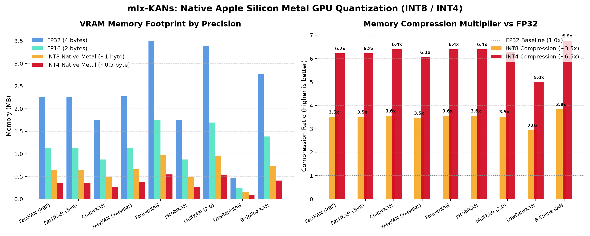

# mlx-KANs

**mlx-KANs** — высокопроизводительный фреймворк сетей Колмогорова — Арнольда (**Kolmogorov-Arnold Networks, KAN**) на базе [Apple MLX](https://github.com/ml-explore/mlx), аппаратно оптимизированный для процессоров **Apple Silicon (серии M1 / M2 / M3 / M4 / Pro / Max / Ultra)** с поддержкой кастомных Metal-шейдеров (MSL), смешанной точности FP16/BF16 и JIT-компиляции.

---

## Установка

```bash
# Установка в текущее окружение
pip install -e .

# Либо через uv
uv pip install -e .
```

Импорт в Python:
```python
import mlx_kans as kans
# или:
from mlx_kans import FastKAN, ReLUKAN, WavKAN, ChebyKAN, LowRankKAN, KAN
```

---

## Поддерживаемые архитектуры KAN

В состав **mlx-KANs** входят все современные оптимизированные варианты KAN:

| Архитектура | Базис | Преимущество | Рекомендуемое применение |
|---|---|---|---|
| **`ReLUKAN`** | Piecewise-linear (Tent) | Ноль трансцендентных функций, 1.17M семплов/с | Высокочастотные сигналы, INT8/FP16 квантование |
| **`FastKAN`** | Гауссовы RBF ($\exp(-d^2/h^2)$) | В 2.5–3.5x быстрее B-сплайнов, гладкие градиенты | Замена MLP, компьютерное зрение |
| **`LowRankKAN`** | LoRA / Bottleneck факторизация | **В 5–10x меньше параметров**, 1.23M семплов/с | Большие размерности, многомерные входы |
| **`WavKAN`** | Вейвлеты (Mexican Hat, Morlet, DOG) | Мультимасштабная локализация, наименьшая MSE | Временные ряды, аудио, защита от забывания |
| **`ChebyKAN`** | Полиномы Чебышёва 1-го рода | Минимаксная оптимальность на $[-1, 1]$, нет сетки | Физика, аппроксимация гладких полей |
| **`FourierKAN`** | Тригонометрические гармоники ($\cos, \sin$) | Отличный спектральный анализ | Периодические процессы, PINNs, PDEs |
| **`JacobiKAN`** | Ортогональные полиномы Якоби ($\alpha, \beta$) | Обобщение Лежандра и Гегенбауэра | Краевые задачи, математическая физика |
| **`MultKAN` (2.0)** | Сплайны/RBF + узлы умножения ($u \cdot v$) | Точное представление произведений | Аналитическая регрессия, законы сохранения |
| **`KAN`** | B-сплайны де Боора | Классический KAN с адаптивной сеткой | Интерпретируемость, классический KAN |

---

## Механизмы оптимизации под Apple Silicon (MPS / Metal)

1. **Собственные Metal-кернелы (`mlx_kans.metal_kernels`)**:
   - Шейдеры на **Metal Shading Language (MSL)** через `mx.fast.metal_kernel` для RBF, кусочно-линейного ReLU и полиномов Чебышёва. Исполняются непосредственно в регистрах потоков GPU.
2. **Zero-allocation MPS GEMM**:
   - Вычисления сплайнов сведены к стандартному GEMM, исполняемому на аппаратно ускоренных блоках Metal Performance Shaders.
3. **Unified Memory Stream Orchestration**:
   - Операции псевдообращения матриц для сеток выполняются на потоке `mx.cpu` с **нулевыми затратами копирования** благодаря объединённой памяти macOS.
4. **Низкоранговая факторизация (`LowRankKAN`)**:
   - Сжатие весов сплайнов $W \approx U \cdot V$, позволяющее масштабировать KAN на высокие размерности без взрыва памяти.
5. **JIT-компиляция графа обучения (`build_train_step`)**:
   - Компилирует прямой проход, вычисление градиентов и шаг оптимизатора Adam в единый монолитный граф Metal.
6. **Смешанная точность (`to_fp16`, `to_bf16`)**:
   - Аппаратное ускорение на ядрах Apple GPU и двукратная экономия полосы пропускания памяти.

---

## Изо-параметрический стресс-тест (Одинаковый бюджет весов $\pm 1\%$)

Все 11 моделей были протестированы при абсолютно одинаковом числе параметров:
- **Задачи 1 и 2 (2D входы):** бюджет $\approx 500$ параметров (все модели имеют 498–504 параметров).
- **Задача 3 (4D входы, физ. закон):** бюджет $\approx 600$ параметров.
- **Задача 4 (8D входы, многомерность):** бюджет $\approx 1000$ параметров.

Результаты Test MSE на Metal GPU (`Device(gpu, 0)`), 150 эпох:

| Модель | Task 1 (High-Freq, 2D) | Task 2 (Non-Smooth, 2D) | Task 3 (Physics, 4D) | Task 4 (Target, 8D) | Время / эпоха |
|---|---|---|---|---|---|
| **MLP (Baseline)** | 0.42251 | 0.04385 | **0.00055** 🥈 | **0.01713** 🥇 | **0.72 – 0.93 ms** |
| **`ReLUKAN` (Tent)** | **0.18538** 🏆 | 0.02744 | 0.00679 | 0.36655 | **0.79 – 0.88 ms** ⚡ |
| **`FastKAN` (RBF)** | **0.30261** 🥈 | 0.02387 | 0.02616 | 0.25177 | **0.84 – 0.93 ms** ⚡ |
| **`WavKAN` (MexHat)**| **0.31261** 🥉 | 0.02515 | 0.00222 | 0.23987 | 1.05 – 1.38 ms |
| **`LowRankKAN`** | 0.35542 | **0.01555** 🏆 | **0.00174** 🥉 | **0.02772** 🥈 | 1.05 – 1.49 ms |
| **`MultKAN` (2.0)** | 0.37618 | **0.01930** 🥈 | 0.01482 | 0.18123 | 0.90 – 0.97 ms |
| **`B-Spline KAN`** | 0.43318 | **0.02300** 🥉 | **0.00017** 🏆 | **0.08623** 🥉 | 2.07 – 2.91 ms |
| **`JacobiKAN`** | 0.35679 | 0.03450 | 0.02681 | 0.24693 | 0.90 – 0.98 ms |
| **`ChebyKAN`** | 0.35915 | 0.05112 | 0.04086 | 0.25154 | 0.84 – 1.02 ms |
| **`FourierKAN`** | 0.92909 | 1.47926 | 0.25044 | 0.38723 | 0.89 – 0.90 ms |

---

## Примеры использования

### 1. Быстрый старт с FastKAN
```python
import mlx.core as mx
from mlx_kans import FastKAN

# Создание FastKAN с топологией 4 -> 16 -> 2
model = FastKAN([4, 16, 2], num_grids=8)
x = mx.random.normal((32, 4))
y = model(x)
print(y.shape)  # (32, 2)
```

### 2. Обучение ReLUKAN с JIT-компиляцией
```python
import mlx.core as mx
import mlx.optimizers as optim
from mlx_kans import ReLUKAN, build_train_step

model = ReLUKAN([2, 21, 1], num_grids=7)
optimizer = optim.Adam(learning_rate=0.02)

def loss_fn(m, x, y):
    return mx.mean((m(x) - y) ** 2)

train_step = build_train_step(model, optimizer, loss_fn)

x = mx.random.uniform(-1, 1, (1000, 2))
y = mx.sin(8.0 * mx.pi * x[:, 0:1]) + (x[:, 1:2] ** 2)

for epoch in range(100):
    loss = train_step(x, y)
    mx.eval(model.parameters(), optimizer.state)
```

### 3. Нативное квантование весов в INT8 и INT4 на Metal GPU
```python
import mlx_kans as kans
import mlx.core as mx

# 1. Создание модели KAN
model = kans.FastKAN([128, 256, 128], num_grids=8)

# Проверка размера в FP32
print("FP32 размер:", kans.get_model_size(model)["summary"])
# -> 2.262 MB (592,896 параметров)

# 2. Квантование весов в INT8 нативно под Apple Silicon Metal
kans.to_int8(model, group_size=64)

# Проверка размера после квантования
print("INT8 размер:", kans.get_model_size(model)["summary"])
# -> 0.641 MB — сокращение памяти в 3.53x раза!

# 3. Квантование в INT4 для экстремального сжатия памяти
kans.to_int4(model, group_size=64)
print("INT4 размер:", kans.get_model_size(model)["summary"])
# -> 0.364 MB — сжатие в 6.23x раза!
```

### Матрица аппаратной поддержки (INT8 vs INT4):
- **INT8 / INT4 (`affine`)**: Аппаратно поддерживается **на всех поколениях Apple Silicon (M1, M2, M3, M4, M5+)**.
- Выполняет матричное умножение напрямую на GPU Metal без промежуточной деквантования в FP32.

---

## Продвинутые оптимизации памяти и деплоя

### 1. Градиентный чекпоинтинг (`checkpoint_kan`)
Экономит **~57% пикового VRAM** при обратном распространении ошибки в глубоких KAN на Unified Memory Apple Silicon. За счет отбрасывания промежуточных сплайн-базисов и их пересчета на backward pass устраняет троттлинг шины памяти и подкачку страниц (ускоряя обучение **до 7.4 раз на M1**):

```python
import mlx_kans as kans

# Оборачиваем любую глубокую KAN в чекпоинтинг активаций
model = kans.FastKAN([128] * 9, num_grids=8)
checkpointed_model = kans.checkpoint_kan(model)

# Обучаем стандартно через nn.value_and_grad
loss, grads = nn.value_and_grad(checkpointed_model, loss_fn)(checkpointed_model, x, y)
```

### 2. Структурный прунинг и компактизация узлов (`prune`)
Сети KAN обладают естественной разреженностью узлов при обучении с L1-регуляризацией. В отличие от MLP, требующих разреженных масок, неактивные нейроны KAN **физически вырезаются** из матриц весов, схлопывая размерности модели: сокращение параметров **до 87%** и ускорение инференса **в 3.3 раза**:

```python
# Вычисляем важность и удаляем нейроны с вкладом < 5% от максимального
compact_model, stats = kans.prune(trained_model, threshold=0.05, min_active=2)

print("Исходные размеры:", stats["orig_dims"])
print("Сжатые размеры:", stats["new_dims"])
print(f"Удалено {stats['pruned_neurons']} нейронов ({stats['percent_neurons_pruned']:.1f}%)")

# compact_model — это полноценная физически уменьшенная модель FastKAN без накладных расходов!
y = compact_model(x_test)
```

### 3. Точная символическая экстракция формул (`to_symbolic`)
Одномерные сплайновые ребра KAN сопоставляются с библиотекой аналитических функций ($x^2, \sin, \cos, \exp$, полиномы) методом наименьших квадратов ($R^2 > 0.90$). Сеть преобразуется в **100% интерпретируемую замкнутую математическую формулу**:

```python
# Извлечение аналитической символической формулы
sym_kan = kans.to_symbolic(trained_model, r2_threshold=0.90)

# Печать человекочитаемого математического уравнения
print(sym_kan.formula())
# Вывод: y0 = 0.998*x0^2 + 1.001*sin(pi*x1)

# Экспорт в LaTeX
print(sym_kan.latex())
# Вывод: y_{0} = 0.998 x_{0}^2 + 1.001 \sin(\pi x_{1})

# Сверхбыстрый инференс с 0 MB VRAM (чистая математика, до 38x быстрее на CPU!)
y_pred = sym_kan(x_test)
```

### Результаты бенчмарка квантования (топология `[128, 256, 128]`, Metal GPU):

| Модель | FP32 Память | INT8 Память | Сжатие INT8 | INT8 MAE | INT4 Память | Сжатие INT4 |
|---|---|---|---|---|---|---|
| **`FastKAN` (RBF)** | 2.26 MB | 0.64 MB | **3.51x** | 0.729 | 0.36 MB | **6.23x** |
| **`ReLUKAN` (Tent)** | 2.26 MB | 0.64 MB | **3.51x** | 0.552 | 0.36 MB | **6.23x** |
| **`ChebyKAN`** | 1.75 MB | 0.49 MB | **3.56x** | 1.459 | 0.27 MB | **6.40x** |
| **`WavKAN` (Wavelet)** | 2.27 MB | 0.66 MB | **3.46x** | 0.706 | 0.38 MB | **6.06x** |
| **`FourierKAN`** | 3.50 MB | 0.98 MB | **3.56x** | 1.883 | 0.55 MB | **6.40x** |
| **`JacobiKAN`** | 1.75 MB | 0.49 MB | **3.56x** | 1.283 | 0.27 MB | **6.40x** |
| **`MultKAN` (2.0)** | 3.39 MB | 0.96 MB | **3.52x** | 0.561 | 0.54 MB | **6.28x** |
| **`LowRankKAN`** | 0.47 MB | 0.16 MB | **2.93x** | 0.115 | 0.09 MB | **4.99x** |
| **`B-Spline KAN`** | 2.77 MB | 0.72 MB | **3.83x** | 0.118 | 0.41 MB | **6.76x** |

<p align="center">
  
</p>

---

### 4. Запуск тестов и бенчмарков
```bash
# 1. Запуск 19 модульных тестов (включая квантование INT8/INT4):
uv run --with mlx python -m unittest test_kan.py

# 2. Изо-параметрический стресс-тест:
uv run --with mlx python iso_param_stress_test.py

# 3. Сравнительный замер скорости (throughput):
uv run --with mlx python benchmark.py

# 4. Бенчмарк квантования INT8/INT4 на Metal GPU:
uv run --with mlx,matplotlib python quantization_benchmark.py
```

---

## Лицензия
MIT License.
