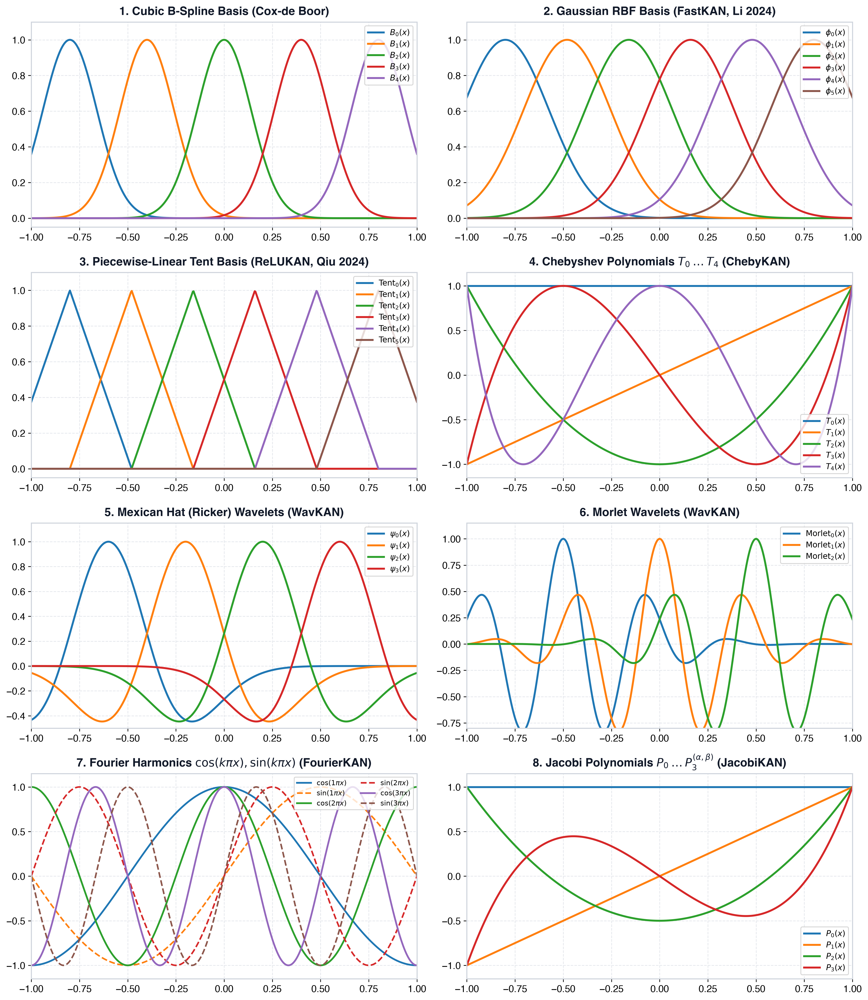

# mlx-KANs: Mathematical Architecture & Foundations

This document provides a rigorous mathematical breakdown of Kolmogorov-Arnold Networks (KAN) and the specific algorithmic reformulations implemented in **mlx-KANs**.

---

## 1. The Kolmogorov-Arnold Representation Theorem

In 1957, mathematicians Andrey Kolmogorov and Vladimir Arnold proved that any continuous multivariate function $f: [0, 1]^n \to \mathbb{R}$ on a bounded domain can be represented as a finite composition of continuous univariate functions and additions:

$$f(x_1, \dots, x_n) = \sum_{q=0}^{2n} \Phi_q \left( \sum_{p=1}^n \phi_{q, p}(x_p) \right)$$

where:
- $\phi_{q, p}: [0, 1] \to \mathbb{R}$ are continuous univariate functions.
- $\Phi_q: \mathbb{R} \to \mathbb{R}$ are continuous univariate functions.

### From Theorem to Deep Learning
While Multi-Layer Perceptrons (MLPs) place fixed non-linear activation functions on **nodes** and learn linear weights on **edges**:
$$y_j = \sigma\left(\sum_i W_{j, i} x_i + b_j\right)$$

Kolmogorov-Arnold Networks (Liu et al., 2024) place learnable 1D functions directly on the **edges**:
$$y_j = \sum_{i=1}^{d_{in}} \phi_{j, i}(x_i)$$

Each connection $(i \to j)$ learns its own nonlinear transformation $\phi_{j, i}(x)$.

---

## 2. Why Original pykan Was Slow (The Memory Bottleneck)

In the naive KAN formulation:
1. For an input batch of size $B$ and $d_{in}$ features, each element $x_i$ is mapped through $d_{out}$ separate spline functions.
2. This creates an intermediate 3D activation tensor of size:
   $$(B, d_{in}, d_{out})$$
3. When $B=1024, d_{in}=64, d_{out}=64$, storing intermediate activations requires **$4{,}194{,}304$ elements per layer**, overflowing GPU L1/L2 caches and causing severe memory bandwidth throttling.

---

## 3. The Efficient-KAN Reformulation (GEMM Transformation)

**Efficient-KAN** (Blealtan, 2024) observes that $\phi_{j, i}(x_i)$ is expanded in a linear combination of basis functions $\mathcal{B}_m$:
$$\phi_{j, i}(x_i) = b(x_i) \cdot w_{base} + \sum_{m=1}^{K} c_{j, i, m} \mathcal{B}_m(x_i)$$

Notice that the basis evaluation $\mathcal{B}_m(x_i)$ **depends only on the input $x_i$**, not on the output channel $j$!

Therefore:
1. Evaluate basis functions once on the input:
   $$\mathcal{B}(x) \in \mathbb{R}^{B \times d_{in} \times K}$$
2. Flatten the input basis tensor to shape $(B, d_{in} \cdot K)$.
3. Flatten the learnable coefficient tensor $W_{spline}$ to shape $(d_{out}, d_{in} \cdot K)$.
4. The forward pass becomes a single, highly optimized **Matrix Multiplication (GEMM)**:
   $$y_{spline} = \mathcal{B}_{flat}(x) \cdot W_{spline}^T$$

On Apple Silicon, this execution runs on the hardware-accelerated **Metal Performance Shaders (MPS)** GEMM units.

---

## 4. Basis Function Families in mlx-KANs

  

### A. Cubic B-Splines (`KANLinear`)
Defined via the Cox-de Boor recursion over a knot vector $\{t_0, \dots, t_{G+2k}\}$:
$$B_{i, 0}(x) = \begin{cases} 1, & t_i \le x < t_{i+1} \\ 0, & \text{otherwise} \end{cases}$$
$$B_{i, k}(x) = \frac{x - t_i}{t_{i+k} - t_i} B_{i, k-1}(x) + \frac{t_{i+k+1} - x}{t_{i+k+1} - t_{i+1}} B_{i+1, k-1}(x)$$
- **Properties**: Compact local support, partition of unity ($\sum B_m(x) \equiv 1$).
- **Drawback**: Branching and recursion are computationally expensive on GPUs.

### B. Gaussian Radial Basis Functions (`FastKANLinear`)
$$\phi_m(x) = \exp\left(-\left(\frac{x - c_m}{h}\right)^2\right)$$
- Uniformly spaced centers $c_m \in [-1, 1]$, width $h = \Delta c$.
- **Properties**: Smooth ($C^\infty$), infinitely differentiable, bell-shaped response similar to cubic B-splines.
- **Speedup**: No branching, ~3x faster forward and backward passes.

### C. Piecewise-Linear Tent Functions (`ReLUKANLinear`)
$$\phi_m(x) = \max\left(0, 1 - \frac{|x - c_m|}{h}\right)$$
- Evaluated purely with elementary ALU operations: $\text{abs}$, $\text{sub}$, $\max(0, \cdot)$.
- **Properties**: Zero transcendental functions, partition of unity, ideal for FP16 and INT8 quantization.

### D. Chebyshev Polynomials of the 1st Kind (`ChebyKANLinear`)
$$T_0(x) = 1, \quad T_1(x) = x, \quad T_{n+1}(x) = 2x T_n(x) - T_{n-1}(x)$$
- Orthogonal on $[-1, 1]$ with respect to weight $(1 - x^2)^{-1/2}$.
- **Properties**: Minimax polynomial approximation (minimizes the maximum error $\max |f(x) - P(x)|$). Eliminates grid relocation entirely.

### E. Continuous Multiresolution Wavelets (`WavKANLinear`)
For scaled and translated coordinate $z = \frac{x - t}{s}$:
- **Mexican Hat (Ricker)**: $\psi(z) = (1 - z^2) \exp(-z^2/2)$
- **Morlet**: $\psi(z) = \cos(5z) \exp(-z^2/2)$
- **Properties**: Simultaneous localization in spatial and frequency domains. Prevents catastrophic forgetting in continual learning.

### F. Fourier Trigonometric Series (`FourierKANLinear`)
$$\mathcal{B}(x) = [1, \cos(\pi x), \sin(\pi x), \dots, \cos(K\pi x), \sin(K\pi x)]$$
- **Properties**: Global periodicity, zero boundary jump artifacts, optimal for physics-informed neural networks (PINNs) and acoustics.

### G. Jacobi Polynomials (`JacobiKANLinear`)
Three-term recurrence parameterized by exponents $\alpha, \beta > -1$:
$$2n(n+\alpha+\beta)(2n+\alpha+\beta-2) P_n = (2n+\alpha+\beta-1)[(2n+\alpha+\beta)(2n+\alpha+\beta-2)x + \alpha^2 - \beta^2] P_{n-1} - 2(n+\alpha-1)(n+\beta-1)(2n+\alpha+\beta) P_{n-2}$$
- Generalizes Legendre ($\alpha=\beta=0$) and Gegenbauer polynomials.

### H. Multiplicative Nodes (`MultKANLinear`, KAN 2.0)
Divides output channels into $n_{add}$ additive and $n_{mult}$ multiplicative nodes:
$$y = [y_{add}, \; u_1 \cdot v_1, \; u_2 \cdot v_2, \dots]$$
- **Properties**: Exact representation of physical products ($F = ma$, $PV = nRT$) without needing infinite series expansions.

### I. Low-Rank Factorization (`LowRankKANLinear`)
Factorizes the projection matrix into low-rank factors of rank $r \ll \min(d_{in}, d_{out})$:
$$W_{spline} = U \cdot V, \quad V \in \mathbb{R}^{r \times (d_{in} \cdot K)}, \; U \in \mathbb{R}^{d_{out} \times r}$$
Forward execution uses two cascaded GEMMs:
$$\text{intermediate} = \mathcal{B}_{flat}(x) \cdot V^T \quad (B \times r)$$
$$y_{spline} = \text{intermediate} \cdot U^T \quad (B \times d_{out})$$
- **Properties**: Cuts parameter count from $d_{out} d_{in} K$ to $(d_{out} + d_{in} K) r$, enabling KAN to scale to high dimensions ($D \ge 64$).

---

## 5. Complexity Comparison Table

| Architecture | Basis Complexity per Sample | Parameter Count (Layer) | Memory Traffic |
|---|---|---|---|
| **Standard MLP** | $\mathcal{O}(1)$ | $d_{in} d_{out}$ | Minimal |
| **B-Spline KAN** | $\mathcal{O}(d_{in} \cdot k^2)$ | $d_{in} d_{out} (G + k)$ | High |
| **FastKAN (RBF)** | $\mathcal{O}(d_{in} \cdot G)$ | $d_{in} d_{out} G$ | Medium |
| **ReLUKAN (Tent)** | $\mathcal{O}(d_{in} \cdot G)$ | $d_{in} d_{out} G$ | Low |
| **ChebyKAN** | $\mathcal{O}(d_{in} \cdot \text{deg})$ | $d_{in} d_{out} \cdot \text{deg}$ | Low |
| **WavKAN** | $\mathcal{O}(d_{in} \cdot W)$ | $d_{in} d_{out} W + 2W d_{in}$ | Medium |
| **FourierKAN** | $\mathcal{O}(d_{in} \cdot K)$ | $d_{in} d_{out} (2K + 1)$ | Low |
| **LowRankKAN** | $\mathcal{O}(d_{in} \cdot G)$ | $(d_{out} + d_{in} G) \cdot r$ | Minimal |
