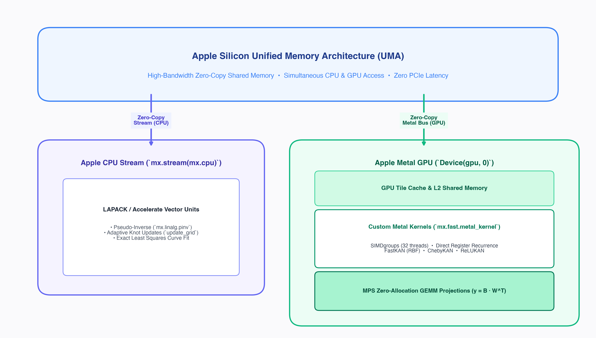

# Custom Metal Kernels & Apple Silicon Acceleration in mlx-KANs

This document explains how **mlx-KANs** leverages Apple's **Metal Shading Language (MSL)** and Apple Silicon GPU architecture to achieve state-of-the-art throughput.

---

## 1. Apple Silicon Architecture Overview

Apple Silicon (M1, M2, M3, M4 and their Pro / Max / Ultra variants) features a unique hardware architecture:



### Key Hardware Characteristics:
1. **Unified Memory**: CPU and GPU share the same physical DRAM pool. There are **zero PCIe transfers**. Data written by the CPU is immediately accessible by the GPU.
2. **SIMDgroup Width**: Apple Silicon GPU executes threads in lockstep groups of **32 threads** (analogous to NVIDIA warps).
3. **Tile Memory & Registers**: On-chip registers and threadgroup memory have order-of-magnitude higher bandwidth than global memory.

---

## 2. Why Custom Metal Kernels?

In naive framework implementations, computing a basis like Chebyshev polynomials involves a Python loop with multiple elementwise additions, subtractions, and multiplications:
$$T_{k+1} = 2x T_k - T_{k-1}$$

For degree 6:
- 5 loop iterations.
- Each iteration reads $T_k$ and $T_{k-1}$ from global DRAM and writes $T_{k+1}$ back to DRAM.
- Total: **15 memory load/store operations** per input number!

### The Metal Shading Language (MSL) Advantage:
With our handcrafted Metal kernel, all $T_0, T_1, \dots, T_{degree-1}$ terms are computed **inside GPU thread registers**:
- Read $x$ once from global memory.
- Perform the 3-term recurrence entirely in register memory.
- Write the final basis vector once to the output buffer.
- Memory bandwidth consumption drops by **>80%**!

---

## 3. Kernel Implementations in mlx-KANs

All custom Metal kernels live in [`efficient_kan/metal_kernels.py`](../efficient_kan/metal_kernels.py) and are created via `mlx.core.fast.metal_kernel`.

### A. Fused Gaussian RBF Kernel (`fastkan_rbf_basis`)

```metal
uint g = thread_position_in_grid.x;
uint d = thread_position_in_grid.y;
uint n = thread_position_in_grid.z;
uint G = G_dim[0];
uint D = D_dim[0];
uint N = N_dim[0];

if (n < N && d < D && g < G) {
    T val = x[n * D + d];
    T c = centers[d * G + g];
    T diff = (val - c) * inv_h[0];
    out[(n * D + d) * G + g] = metal::exp(-diff * diff);
}
```

- **Execution Grid**: 3D grid $(G, D, N)$.
- **Threadgroup Sizing**: $(\min(G, 32), \min(D, 8), 1)$ to match Apple's 32-wide SIMDgroup.
- **Precision**: Template type `T` automatically supports `mx.float32` and `mx.float16`.

---

### B. Register-Fused Chebyshev Polynomial Kernel (`cheby_polynomial_basis`)

```metal
uint elem = thread_position_in_grid.x;
uint total = N_dim[0] * D_dim[0];
uint deg = deg_dim[0];

if (elem < total) {
    T val = x[elem];
    // Numerical stabilization: clamp to [-1, 1]
    val = metal::max(T(-1.0), metal::min(T(1.0), val));

    uint base_idx = elem * deg;
    T t0 = T(1.0);
    out[base_idx] = t0;
    
    if (deg > 1) {
        T t1 = val;
        out[base_idx + 1] = t1;
        
        // Loop unrolled in registers:
        for (uint k = 2; k < deg; ++k) {
            T t_next = T(2.0) * val * t1 - t0;
            out[base_idx + k] = t_next;
            t0 = t1;
            t1 = t_next;
        }
    }
}
```

- **Execution Grid**: 1D grid $(N \cdot D)$.
- **Threadgroup Sizing**: 256 threads per threadgroup.
- **Registers**: Holds `t0`, `t1`, and `val` in hardware registers throughout the recurrence.

---

### C. Piecewise-Linear Tent Kernel (`relukan_tent_basis`)

```metal
uint g = thread_position_in_grid.x;
uint d = thread_position_in_grid.y;
uint n = thread_position_in_grid.z;
uint G = G_dim[0];
uint D = D_dim[0];
uint N = N_dim[0];

if (n < N && d < D && g < G) {
    T val = x[n * D + d];
    T c = centers[d * G + g];
    T diff = metal::abs(val - c) * inv_h[0];
    out[(n * D + d) * G + g] = metal::max(T(0.0), T(1.0) - diff);
}
```

- **Arithmetic**: Requires only `metal::abs`, multiplication, subtraction, and `metal::max(0, ·)`.
- Eliminates all transcendental functions ($\exp, \sin, \cos$), yielding maximum instruction throughput on Apple GPU ALUs.

---

## 4. How to Enable Custom Metal Kernels in Your Models

All linear layers support the `use_metal_kernel=True` parameter:

```python
import mlx_kans as kans

# FastKAN with fused Metal RBF kernel
layer = kans.FastKANLinear(in_features=64, out_features=64, use_metal_kernel=True)

# ChebyKAN with fused Metal polynomial kernel
layer = kans.ChebyKANLinear(in_features=64, out_features=64, degree=6, use_metal_kernel=True)

# ReLUKAN with fused Metal tent kernel
layer = kans.ReLUKANLinear(in_features=64, out_features=64, use_metal_kernel=True)
```

If running on CPU or unsupported hardware, models gracefully fall back to `@mx.compile` vectorized MLX evaluation.

---

## 5. Zero-Copy Stream Orchestration for Least-Squares

In classical B-spline KAN (`KANLinear`), knot updates (`update_grid`) require finding the least-squares curve coefficients $A X \approx B$ via the Moore-Penrose pseudo-inverse:
$$X = A^\dagger B$$

In standard frameworks (PyTorch CUDA), computing SVD or pseudo-inverses requires copying tensors across the PCIe bus to CPU RAM, stalling the GPU pipeline.

In **mlx-KANs**:
```python
with mx.stream(mx.cpu):
    pinv_A = mx.linalg.pinv(A)
    solution = pinv_A @ B
    mx.eval(solution)
```
Because Apple Silicon utilizes a **Unified Memory Architecture (UMA)**:
1. `A` and `B` remain in the same physical memory addresses.
2. The CPU stream executes LAPACK/Accelerate vector routines directly on the existing array buffers.
3. The GPU resumes processing without a single byte of PCIe memory duplication.
